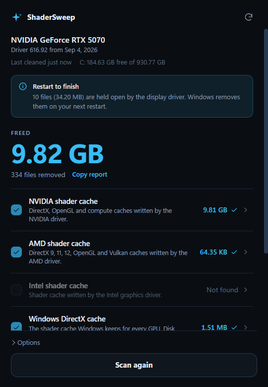
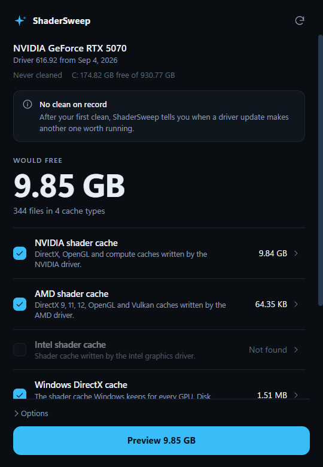

<div align="center">


# ShaderSweep

**Clear NVIDIA, AMD, Intel, Windows and Steam shader caches in one click, and find out when a new driver makes it worth doing.**

[](#requirements)
[](LICENSE)
[](https://github.com/Kkthnx/ShaderSweep/releases/latest)




</div>

ShaderSweep is a small Windows app (about 3 MB, no installer) that empties the shader caches your graphics driver and Windows build up. It shows exactly what it found and how big each cache is before it deletes anything, and it reports what it really freed afterwards.

Stale or corrupted shader caches are a common cause of crashes on launch, stutter, flickering and visual artifacts. NVIDIA's own support article tells you to delete them for that reason: [Deleting NVIDIA Shader Cache files](https://nvidia.custhelp.com/app/answers/detail/a_id/5735/).

---

## When to run it

- A game crashes on launch, stutters, flickers or shows odd artifacts.
- You just installed a new GPU driver and want the old driver's leftovers gone.
- You want the disk space back. On a gaming PC the NVIDIA cache alone often reaches several gigabytes.

ShaderSweep remembers which driver each GPU had the last time you cleaned. When the driver changes, it tells you.

**Cleaning after every driver update is optional, and we would rather say so.** Drivers and Windows version their caches, so shaders built for an older driver are ignored on their own. Microsoft's spec says the D3D cache is "implicitly versioned by the driver being used". Cleaning mainly reclaims the old space and helps when something is actually wrong. If you turned on **Auto Shader Compilation** in the NVIDIA App (driver 595.97 and newer), it pre-builds shaders after an update, so leave the NVIDIA row unchecked and keep that work.

---

## Download

Grab `ShaderSweep-<version>.zip` or the single `.exe` from the [latest release](https://github.com/Kkthnx/ShaderSweep/releases/latest), then run it. Windows asks for administrator rights because some caches belong to the system and driver service accounts.

The exe is not code signed yet, so Windows SmartScreen may warn you the first time. Each release lists a SHA-256 hash you can check. The source is all here, and CI builds it.

---

## What it clears

Every row is a folder name that only ever holds regenerable cache data. Folders are found by name under known vendor locations, so new driver layouts such as `PerDriverVersion` are picked up automatically.

| Row | Where | Source |
| --- | --- | --- |
| NVIDIA shader cache | `AppData\Local\NVIDIA` (`DXCache`, `GLCache`), `LocalLow\NVIDIA` (`DXCache`, `PerDriverVersion`), `Roaming\NVIDIA\ComputeCache`, `NV_Cache`, plus the system and service profiles | [NVIDIA support](https://nvidia.custhelp.com/app/answers/detail/a_id/5735/), the [DDU cache list](https://www.wagnardsoft.com/forums/viewtopic.php?t=3821) |
| AMD shader cache | `AppData\Local\AMD` (`DX9Cache`, `DxCache`, `DxcCache`, `OglCache`, `VkCache`) | [AMD cache investigation](https://gist.github.com/pbhj/ccae7ef1d1446f4450005de139c601c4) |
| Intel shader cache | `AppData\LocalLow\Intel\ShaderCache` | [Microsoft Q&A](https://learn.microsoft.com/en-us/answers/questions/3975387/is-it-safe-to-delete-locallowintelshadercache) |
| Windows DirectX cache | `AppData\Local\D3DSCache` | [DirectX spec](https://microsoft.github.io/DirectX-Specs/d3d/ShaderCache.html) and the Disk Cleanup entry Windows ships for it |
| Steam shader cache | `steamapps\shadercache` in every Steam library | Steam install and `libraryfolders.vdf` |
| Driver installer leftovers | `C:\AMD` and `C:\NVIDIA\DisplayDriver` | Extracted installers. **Off by default** so you can still roll back |

Your own profile, every other user profile, the system profile and the service accounts are all covered. If you moved the OpenGL cache with NVIDIA's `__GL_SHADER_DISK_CACHE_PATH` variable, that folder is cleared too.

### What it never touches

Games, saves, settings, drivers, the NVIDIA App or any folder not on that list. The interface only ever sends a row name. The backend rebuilds every path itself and checks each one against a fixed allow list before deleting. It refuses drive roots, anything with `..` in it, and any cache folder that has been swapped for a junction or symlink. Links found *inside* a cache are removed without ever being followed.

### Not included on purpose

Prefetch, temp files, the Windows Update cache, the standby list and registry tweaks. Deleting Prefetch only slows the next launch of your apps, and the rest do nothing for frame rate. Tools that bundle them are mostly selling a feeling.

---

## Locked files

A few cache files (`.nvph` index files) are held open by the kernel mode display driver itself. No program or service can release them while Windows runs, which is the real reason NVIDIA's steps involve a reboot.

ShaderSweep queues those for deletion at the next restart using the same Windows call installers use. It reports them honestly as "held by the display driver" instead of counting them as freed. If something else is holding files, it asks Windows which program it is and names it, using the Restart Manager.

Space freed is counted per file that was actually deleted, never taken from the size before the run.

---

## Options

- **Preview only** shows what would be removed and deletes nothing.
- **Remove driver held files at restart** can be turned off if you would rather leave them.

**Copy report** on the result screen puts a plain text summary on your clipboard, handy for a bug report. The same text is saved to `%LOCALAPPDATA%\ShaderSweep\last-run.txt` after every real clean. Each cache row also expands to show its exact folders, with an **Open** button for each.

---

## Headless mode

For chaining after a driver install or running from a scheduled task, start the exe with `--clean`. No window opens.

```powershell
.\ShaderSweep.exe --clean --preview
.\ShaderSweep.exe --clean --only nvidia,windows
.\ShaderSweep.exe --clean --installers --no-restart-queue
```

| Option | What it does |
| --- | --- |
| `--preview` | Measure only, delete nothing |
| `--only a,b` | Only these rows: `nvidia`, `amd`, `intel`, `windows`, `steam`, `installers` |
| `--installers` | Also clear driver installer leftovers |
| `--no-restart-queue` | Do not queue driver held files for the next restart |

Exit codes are `0` done, `1` some files were in use, `2` error. The result goes to `last-run.txt`, and is printed too when you run it from an elevated terminal.

---

## Requirements

- Windows 10 or 11 (64 bit) with the WebView2 runtime, which Windows 11 includes
- Administrator rights

---

## Build from source

You need Node 22 or newer, Rust, and the Visual Studio C++ build tools.

```bash
cd app
npm ci --ignore-scripts
npm run tauri -- build --no-bundle
```

The exe lands in `app/src-tauri/target/release/shadersweep.exe`. Run the checks with:

```bash
cd app/src-tauri
cargo fmt --check
cargo clippy --all-targets -- -D warnings
cargo test
```

The suite includes full scan and clean runs against a made up machine in a temp folder, so deleting is tested without touching your real caches. Two tests are marked `ignored` because one writes to the system's pending delete queue and one prints a real scan. Run them with `cargo test -- --ignored` when you want them.

---

## The PowerShell script

The original script is still in `NvidiaShaderCleanup/` for automation, for example chaining it after a driver install with `-NoPause`. It covers the NVIDIA and Windows caches only. See [CHANGELOG.md](CHANGELOG.md) for its history.

---

## FAQ

**Is it safe?**
Yes. It only deletes folders from a fixed list of regenerable caches, and only after showing you their size. Use **Preview only** first if you want to see the exact result.

**Why does a game stutter right after I clean?**
Its shaders are being rebuilt. That happens once per game and then goes away.

**Why does it need administrator rights?**
The driver service writes caches under the system profile, and queueing driver held files for restart writes to the machine part of the registry.

**Will it restart or flicker my screen?**
No. It does not stop any service or process. Older versions of the script restarted NVIDIA services, and testing showed it made no difference to which files stayed locked.

**Where does it keep its data?**
One small file, `%LOCALAPPDATA%\ShaderSweep\state.json`, holding the time of the last clean and the driver version per GPU. Delete the exe and that folder to remove it completely.

---

## License

[MIT](LICENSE) by Kkthnx
