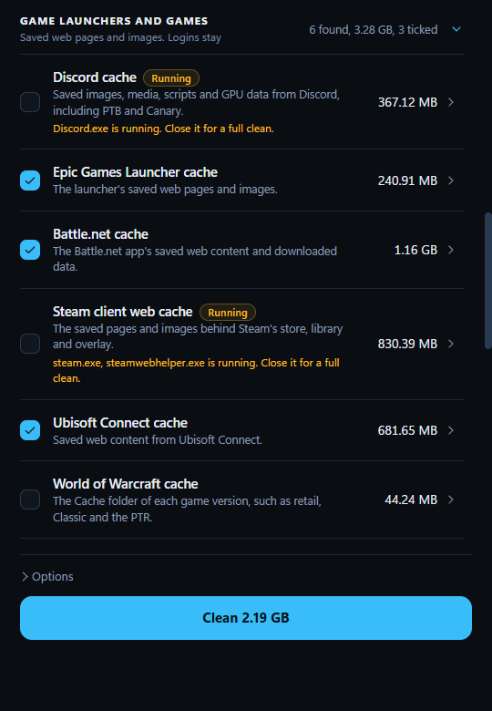
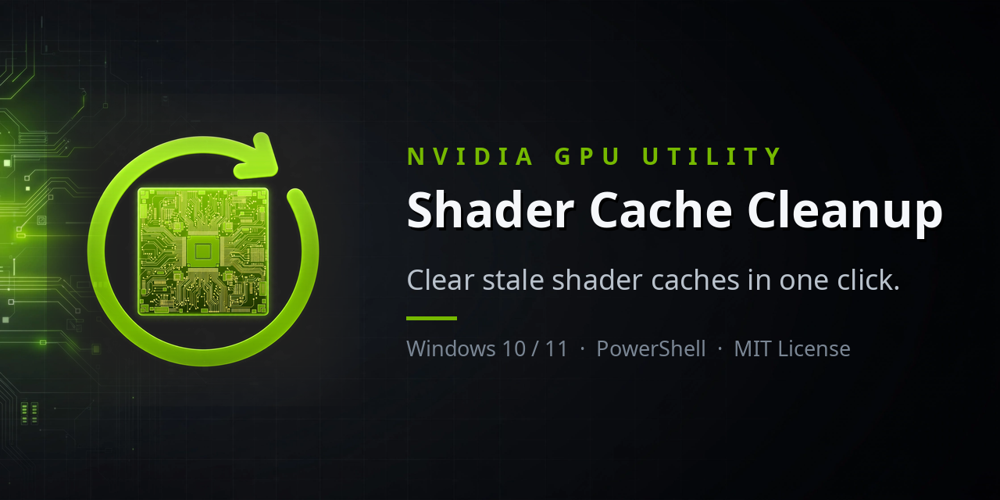

<div align="center">


# ShaderSweep

**Clear shader caches, game launcher caches and Windows clutter in one click. It shows you what it found first, shows the work as it happens, and checks afterwards that it worked.**

[](#requirements)
[](LICENSE)
[](https://github.com/Kkthnx/ShaderSweep/releases/latest)





</div>

ShaderSweep is a small Windows app (about 3 MB, no installer) that empties the caches your graphics driver, your game launchers and Windows build up. Those screenshots are the real app on a real gaming PC.

Stale or corrupted shader caches are a common cause of crashes on launch, stutter, flickering and visual artifacts. NVIDIA's own support article tells you to delete them for that reason: [Deleting NVIDIA Shader Cache files](https://nvidia.custhelp.com/app/answers/detail/a_id/5735/).

---

## Install

Pick whichever you like. None of them needs administrator rights to install. The app asks for them when you run it.

**PowerShell** (checks the download against its published SHA-256 hash first)

```powershell
irm https://raw.githubusercontent.com/Kkthnx/ShaderSweep/main/install.ps1 | iex
```

To pick options, or to remove it again, run the script as a script block:

```powershell
& ([scriptblock]::Create((irm https://raw.githubusercontent.com/Kkthnx/ShaderSweep/main/install.ps1))) -AddToPath
& ([scriptblock]::Create((irm https://raw.githubusercontent.com/Kkthnx/ShaderSweep/main/install.ps1))) -Uninstall
```

**Scoop**

```powershell
scoop bucket add shadersweep https://github.com/Kkthnx/ShaderSweep
scoop install shadersweep
```

**Chocolatey** (the package source is in [packaging/chocolatey](packaging/chocolatey). It was tested with a local install and is not on the community feed yet)

```powershell
choco pack packaging\chocolatey\shadersweep.nuspec
choco install shadersweep --source .
```

**Download** `ShaderSweep-<version>.zip` or the single `.exe` from the [latest release](https://github.com/Kkthnx/ShaderSweep/releases/latest). Each release lists a SHA-256 hash you can check.

The exe is not code signed yet, so Windows SmartScreen may warn you the first time. The source is all here, and CI builds the release from it.

---

## What it does

1. **Scans first.** Every cache shows its size and its exact folders before anything is deleted. Rows for apps that are not installed stay out of the way.
2. **Shows the work.** While it cleans, you see the space freed counting up, a progress bar, how many files are gone, how long it has taken, and the actual file being removed. **Cancel** stops it between files, and what is already gone stays gone.
3. **Reports honestly.** Space freed is counted per file that was really deleted. A locked file is never counted as freed, and the app names the program holding it.
4. **Checks afterwards.** Some files cannot be deleted while Windows runs. ShaderSweep queues them for the next restart, remembers which ones, and after the restart tells you whether Windows removed them.

Stale caches mostly matter when something is wrong. **Cleaning after every driver update is optional, and we would rather say so.** Drivers and Windows version their caches, so shaders built for an older driver are ignored on their own. Microsoft's spec says the D3D cache is "implicitly versioned by the driver being used". Cleaning mainly reclaims the old space and helps when a game crashes, stutters or glitches. ShaderSweep remembers each GPU's driver at your last clean and tells you when it changes. If you turned on **Auto Shader Compilation** in the NVIDIA App (driver 595.97 and newer), it pre-builds shaders after an update, so leave the NVIDIA row unchecked and keep that work.

---

## What it clears

Every row is a folder that only ever holds regenerable data. A bare folder name like `Cache` is never trusted. Each rule is the tail of a path, such as `discord\Cache` or `World of Warcraft\_retail_\Cache`, and the folders beside them that hold your login, settings and games match no rule at all.

### Shader caches

| Row | Where | Source |
| --- | --- | --- |
| NVIDIA | `AppData\Local\NVIDIA` (`DXCache`, `GLCache`), `LocalLow\NVIDIA` (`DXCache`, `PerDriverVersion`), `Roaming\NVIDIA\ComputeCache`, `NV_Cache`, plus the system and service profiles | [NVIDIA support](https://nvidia.custhelp.com/app/answers/detail/a_id/5735/), the [DDU cache list](https://www.wagnardsoft.com/forums/viewtopic.php?t=3821) |
| AMD | `AppData\Local\AMD` (`DX9Cache`, `DxCache`, `DxcCache`, `OglCache`, `VkCache`) | [AMD cache investigation](https://gist.github.com/pbhj/ccae7ef1d1446f4450005de139c601c4) |
| Intel | `AppData\LocalLow\Intel\ShaderCache` | [Microsoft Q&A](https://learn.microsoft.com/en-us/answers/questions/3975387/is-it-safe-to-delete-locallowintelshadercache) |
| Windows DirectX | `AppData\Local\D3DSCache` | [DirectX spec](https://microsoft.github.io/DirectX-Specs/d3d/ShaderCache.html) and the Disk Cleanup entry Windows ships for it |
| Steam shaders | `steamapps\shadercache` in every Steam library | Steam install and `libraryfolders.vdf` |

### Game launchers and games

These are Chromium style disk caches, so the app rebuilds them. Your login stays. A row for a program that is running right now starts unticked, because a running app keeps its files locked, and it tells you which app to close.

| Row | Where | Source |
| --- | --- | --- |
| Discord | `discord`, `discordptb`, `discordcanary`: `Cache`, `Code Cache`, `GPUCache`, `Dawn*Cache` | [How-To Geek](https://www.howtogeek.com/686597/how-to-clear-discord-cache-files-on-desktop-and-mobile/) |
| Epic Games Launcher | `EpicGamesLauncher\Saved\webcache*` | [Epic support](https://www.epicgames.com/help/c-32735058/a20673770) |
| Battle.net | `AppData\Local\Battle.net\Cache` and `BrowserCaches` | [community guidance](https://isitsafetodelete.com/files/battlenet-cache) |
| Steam client | `AppData\Local\Steam\htmlcache`, which is what Steam's own Delete web browser cache button clears | [Steam discussion](https://steamcommunity.com/discussions/forum/1/558747288083286747) |
| EA app | `Electronic Arts\EA Desktop\Cache` | [EA help](https://help.ea.com/en/articles/technical-issues/clear-cache/) |
| Ubisoft Connect | `Ubisoft Game Launcher\cache` | [community guide](https://techdepot.blog/how-to-clear-ubisoft-connect-cache) |
| GOG Galaxy | `GOG.com\Galaxy\webcache` | [GOG forum](https://www.gog.com/forum/general/where_does_galaxy_cache_images) |
| World of Warcraft | the `Cache` folder of each game version. `WTF`, `Interface` and `Data` are never touched. Off by default | [Blizzard forums](https://us.forums.blizzard.com/en/wow/t/how-to-delete-cache-after-8-1/57689) |

Several of these sources are community guides rather than the vendor's own pages. Where the vendor has one, it is the one linked.

### Windows housekeeping

The risky ones start off.

| Row | Starts | What to know |
| --- | --- | --- |
| Temporary files | on | Only files untouched for 24 hours, so a running installer is not pulled out from under itself |
| Thumbnail cache | on | Only the `thumbcache` database files in Explorer's folder, nothing else there |
| Delivery Optimization files | on | Disk Cleanup lists these too |
| Windows Update downloads | off | Skip while an update is installing. No service is stopped |
| Prefetch | off | Does not make anything faster, so it is here only for people who want it gone |
| Error reports and crash dumps | off | They are the evidence if you are chasing a crash |
| GPU crash dumps | off | One dump from a GPU timeout can be several gigabytes. [Safe to delete](https://techcommunity.microsoft.com/discussions/windowsinsiderprogram/is-it-safe-to-delete-livekernelreports-watchdog-dmp-files/4213915), but keep it if a vendor may ask |
| Recycle Bin | off | Emptied through Windows. Cannot be undone |
| Event Viewer logs | off | The **Security log is never cleared**. Cannot be undone |
| Driver installer leftovers | off | `C:\AMD` and `C:\NVIDIA\DisplayDriver`, so you can still roll back |

Prefetch, the standby list and registry tweaks are not "game boosters", and ShaderSweep does not pretend they are.

### What it never touches

Games, saves, settings, logins, drivers or any folder not on those lists. The window only ever sends a row name. The backend rebuilds every path and checks it against a fixed allow list before deleting. It refuses drive roots, anything with `..` in it, and any cache folder that has been swapped for a junction or symlink. Links found inside a cache are removed without ever being followed.

---

## Restarting safely

A few cache files (`.nvph` index files) are held open by the kernel mode display driver itself. Nothing you can stop will release them, which is the real reason NVIDIA's steps involve a reboot. ShaderSweep queues them for deletion at the next restart with the same Windows call installers use.

When files are waiting, the app offers **Restart now**. It first asks you to save your work, then starts a 60 second countdown you can cancel. It does this through the Windows restart API with force turned off, so an app with unsaved changes makes Windows stop and ask you. It does **not** use `shutdown /r /t 60`, because Microsoft documents that a timeout above zero implies `/f`, which closes apps without warning and loses unsaved work. It uses Restart rather than Shut down, because a full restart is the sure way to run the delete.

On your next launch, ShaderSweep compares the list of queued files against what is left on disk and tells you the result.

---

## Options and extras

- **Preview only** measures and deletes nothing.
- **Remove driver held files at restart** can be turned off.
- **Copy report** puts a plain text summary on your clipboard. The same text is saved to `%LOCALAPPDATA%\ShaderSweep\last-run.txt` after every real clean.
- Each row expands to show its exact folders, with an **Open** button for each.

### Headless mode

For chaining after a driver install or running from a scheduled task, start the exe with `--clean`. No window opens.

```powershell
.\ShaderSweep.exe --clean --preview
.\ShaderSweep.exe --clean --only nvidia,windows
.\ShaderSweep.exe --clean --include installers,gpudumps
```

| Option | What it does |
| --- | --- |
| `--preview` | Measure only, delete nothing |
| `--only a,b` | Only these rows. The row names are `nvidia`, `amd`, `intel`, `windows`, `steam`, `discord`, `epic`, `battlenet`, `steamclient`, `ea`, `ubisoft`, `gog`, `wow`, `temp`, `thumbnails`, `deliveryopt`, `wucache`, `prefetch`, `errors`, `gpudumps`, `recyclebin`, `eventlogs`, `installers` |
| `--include a,b` | Add rows that start off, such as `installers` |
| `--no-restart-queue` | Do not queue driver held files for the next restart |

A row for a program that is running is skipped unless you name it with `--only`. Exit codes are `0` done, `1` some files were in use, `2` error. The result goes to `last-run.txt`, and is printed too when you run it from an elevated terminal.

---

## Requirements

- Windows 10 or 11 (64 bit) with the WebView2 runtime, which Windows 11 includes
- Administrator rights, which the app asks for when it starts

---

## Build from source

You need Node 22 or newer, Rust, and the Visual Studio C++ build tools.

```bash
cd app
npm ci --ignore-scripts
npm run tauri -- build --no-bundle
```

The exe lands in `app/src-tauri/target/release/shadersweep.exe`. Run the checks with:

```bash
cd app/src-tauri
cargo fmt --check
cargo clippy --all-targets -- -D warnings
cargo test
```

The suite includes full scan and clean runs against a made up machine in a temp folder, so deleting is tested without touching your real caches. A few tests are marked `ignored` because they touch real system state, such as the pending delete queue or a restart countdown that they cancel at once. Run them with `cargo test -- --ignored`.

---

## The PowerShell script



The original script is still in `NvidiaShaderCleanup/` for automation. It covers the NVIDIA and Windows caches only. See [CHANGELOG.md](CHANGELOG.md) for its history.

---

## FAQ

**Is it safe?**
Yes. It only deletes folders from a fixed list of regenerable caches, and only after showing you their size. Use **Preview only** first if you want to see the exact result.

**Why does a game stutter right after I clean?**
Its shaders are being rebuilt. That happens once per game and then goes away.

**Why does it need administrator rights?**
The driver service writes caches under the system profile, and queueing driver held files for restart writes to the machine part of the registry.

**Will it restart or flicker my screen?**
No. It does not stop any service or process, and it only restarts Windows if you press Restart now and confirm.

**Where does it keep its data?**
One small file, `%LOCALAPPDATA%\ShaderSweep\state.json`, holding the time of the last clean, the driver version per GPU, a running total and the files waiting for a restart. Delete the exe and that folder to remove it completely.

---

## Made by Kkthnx

ShaderSweep is made and maintained by Kkthnx. Say hello, report a problem, or see what else is out there:

- Website: [kkthnx.com](https://kkthnx.com/)
- GitHub: [github.com/Kkthnx](https://github.com/Kkthnx)
- Problems and ideas: [open an issue](https://github.com/Kkthnx/ShaderSweep/issues)

## License

[MIT](LICENSE) by Kkthnx
